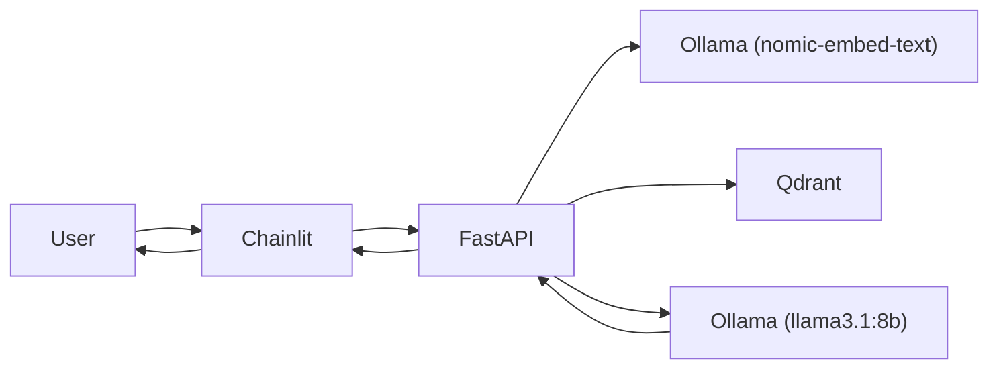

# MoviesRAG

A Retrieval-Augmented Generation (RAG) movie recommendation system built on the [TMDB Movies Dataset](https://www.kaggle.com/datasets/asaniczka/tmdb-movies-dataset-2023-930k-movies). Ask natural-language questions and get answers grounded in movie metadata retrieved from a vector database.

## How it works



1. **Ingest** — Movie titles, overviews, and taglines are embedded with Ollama and stored in Qdrant.
2. **Query** — The user's question is embedded with the same model.
3. **Retrieve** — Qdrant returns the most similar movies (cosine distance).
4. **Generate** — Llama 3.1 answers using only the retrieved context.

## Stack

| Component | Role |
|-----------|------|
| [FastAPI](https://fastapi.tiangolo.com/) | REST API (`/ask` endpoint) |
| [Chainlit](https://docs.chainlit.io/) | Chat UI |
| [Qdrant](https://qdrant.tech/) | Vector store |
| [Ollama](https://ollama.com/) | Embeddings (`nomic-embed-text`) + LLM (`llama3.1:8b`) |
| [pandas](https://pandas.pydata.org/) | Dataset loading |
| [kagglehub](https://github.com/Kaggle/kagglehub) | Dataset download |

## Prerequisites

- [Docker](https://docs.docker.com/get-docker/) and Docker Compose
- [uv](https://docs.astral.sh/uv/) (for local dev tooling only)
- A [Kaggle](https://www.kaggle.com/) account with API credentials at `~/.kaggle/kaggle.json`

## Quick start

```bash
# Install dev dependencies locally (linting, formatting)
make setup

# Start all services (app, Qdrant, Ollama, Chainlit)
make up

# Pull required Ollama models (first time only)
make ollama_init

# Download the TMDB dataset into ./data
make download

# Create the Qdrant collection
make qdrant_init

# Embed and index movies (default: first 200 rows)
make ingest
```

Open the chat UI at **http://localhost:8001** and ask something like:

> I want a mind-bending sci-fi thriller about dreams

### Service URLs

| Service | URL |
|---------|-----|
| Chainlit UI | http://localhost:8001 |
| FastAPI docs | http://localhost:8000/docs |
| Qdrant dashboard | http://localhost:6333/dashboard |

Stop everything with:

```bash
make down
```

## API

**POST** `/ask`

```bash
curl -X POST http://localhost:8000/ask \
  -H "Content-Type: application/json" \
  -d '{"question": "Recommend a dark comedy from the 90s"}'
```

Response:

```json
{
  "question": "Recommend a dark comedy from the 90s",
  "answer": "..."
}
```

## Configuration notes

- **Dataset path** — `src/config.py` points to `/app/data/tmdb/TMDB_movie_dataset_v11.csv` inside the container (mounted from `./data` on the host).
- **Ingest size** — `cmd/ingest.py` indexes the first 200 movies by default. Change the `n` parameter in `ingest()` to index more.
- **Vector dimensions** — 768 (matching `nomic-embed-text`). The Qdrant collection is created with cosine distance.
- **Ollama models** — Embeddings use `nomic-embed-text`; generation uses `llama3.1:8b`. Both must be pulled before ingesting or querying.

## Development

```bash
make setup      # uv sync + dev tools
make lint       # ruff check
make format     # ruff format
make type_check # ty type checker
```

Services run inside Docker with hot-reload enabled for the FastAPI app. Source code is mounted as a volume, so local edits are reflected without rebuilding.
