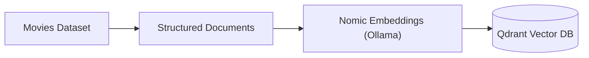
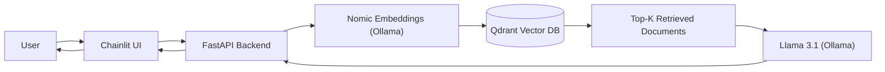

# MoviesRAG

[](https://www.python.org/)
[](https://github.com/astral-sh/uv)
[](https://fastapi.tiangolo.com/)
[](https://www.docker.com/)
[](https://ollama.com/)
[](https://qdrant.tech/)
[](LICENSE)
[](https://docs.chainlit.io/)


A Retrieval-Augmented Generation (RAG) movie recommendation system built on the [TMDB Movies Dataset](https://www.kaggle.com/datasets/asaniczka/tmdb-movies-dataset-2023-930k-movies). Ask natural-language questions and get answers grounded in movie metadata retrieved from a vector database.

---

## Table of Contents

- [MoviesRAG](#moviesrag)
- [How it works](#how-it-works)
- [Stack](#stack)
- [Prerequisites](#prerequisites)
- [Quick start](#quick-start)
  - [Service URLs](#service-urls)
- [Makefile commands](#makefile-commands)
- [API](#api)
- [Configuration](#configuration)
- [Development](#development)

---

## How it works




1. Movie data is cleaned and converted into structured document format.
2. The Nomic embedding model (served via Ollama) generates vector representations of each document.
3. These vectors are stored in Qdrant, where they can be queried using similarity search during runtime.



1. The user interacts with the Chainlit interface, which sends the request to FastAPI.
2. FastAPI uses Nomic (via Ollama) to embed the query and performs a similarity search in Qdrant using cosine distance.
3. The retrieved documents are passed to Llama 3.1 (via Ollama), which generates the final response returned through FastAPI to the interface.

---

## Stack

| Component | Role |
|-----------|------|
| [FastAPI](https://fastapi.tiangolo.com/) | REST API (`/ask`, `/health`, `/ready`) |
| [Chainlit](https://docs.chainlit.io/) | Chat UI |
| [Qdrant](https://qdrant.tech/) | Vector store |
| [Ollama](https://ollama.com/) | Embeddings (`nomic-embed-text`) + LLM (`llama3.1:8b`) |
| [pandas](https://pandas.pydata.org/) | Dataset loading |
| [kagglehub](https://github.com/Kaggle/kagglehub) | Dataset download |

---

## Prerequisites

- [Docker](https://docs.docker.com/get-docker/) and Docker Compose
- [uv](https://docs.astral.sh/uv/) (for local dev tooling)
- A [Kaggle](https://www.kaggle.com/) account with API credentials at `~/.kaggle/kaggle.json`

---

## Quick start

```bash
# Install local dev tools (lint, type check, tests)
make install

# Start all services with hot-reload (development)
make dev

# First-time setup: pull models, init Qdrant, download dataset
make ollama_init
make qdrant_init
make download

# Embed and index movies (default: first 200 rows)
make ingest
```

Or run the full bootstrap in one go:

```bash
make bootstrap
make ingest
```

Open the chat UI at **http://localhost:8001** and ask something like:

> I want a mind-bending sci-fi thriller about dreams

---

### Service URLs

| Service | URL |
|---------|-----|
| Chainlit UI | http://localhost:8001 |
| FastAPI docs | http://localhost:8000/docs |
| Health | http://localhost:8000/health |
| Readiness | http://localhost:8000/ready |
| Qdrant dashboard | http://localhost:6333/dashboard |

Stop everything with:

```bash
make down
```

---

## Makefile commands

Run `make help` to list all Makefile commands.

---

## API

**POST** `/ask`

```bash
curl -X POST http://localhost:8000/ask \
  -H "Content-Type: application/json" \
  -d '{"question": "Recommend a dark comedy from the 90s", "top_k": 5}'
```

Response:

```json
{
  "question": "Recommend a dark comedy from the 90s",
  "answer": "...",
  "sources": [
    {
      "title": "...",
      "genres": "...",
      "overview": "..."
    }
  ]
}
```

---

## Settings

Copy `.env.example` to `.env` to override defaults. All settings are defined in `src/settings.py` via pydantic-settings:

| Variable | Default | Description |
|----------|---------|-------------|
| `OLLAMA_URL` | `http://ollama:11434` | Ollama API base URL |
| `QDRANT_URL` | `http://qdrant:6333` | Qdrant API base URL |
| `EMBEDDING_MODEL` | `nomic-embed-text` | Embedding model |
| `LLM_MODEL` | `llama3.1:8b` | Generation model |
| `COLLECTION_NAME` | `movies` | Qdrant collection |
| `INGEST_LIMIT` | `200` | Default movies to ingest |

Ingest limit can also be set per run:

```bash
docker compose exec app python -m scripts.ingest --limit 500
```

---

## Development

```bash
make install    # uv sync + dev tools
make dev        # docker with hot-reload
make lint       # ruff check
make format     # ruff format
make type_check # ty type checker
make test       # pytest
```
