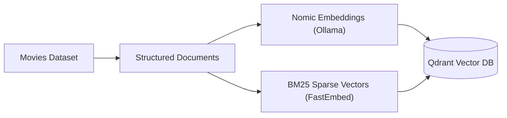
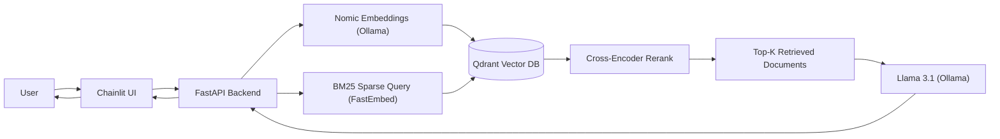

# MoviesRAG

[](https://www.python.org/)
[](https://github.com/astral-sh/uv)
[](https://fastapi.tiangolo.com/)
[](https://www.docker.com/)
[](https://ollama.com/)
[](https://qdrant.tech/)
[](LICENSE)
[](https://docs.chainlit.io/)


A Retrieval-Augmented Generation (RAG) movie recommendation system built on the [TMDB Movies Dataset](https://www.kaggle.com/datasets/asaniczka/tmdb-movies-dataset-2023-930k-movies). Ask natural-language questions and get answers grounded in movie metadata retrieved from a vector database.

---

## Table of Contents

- [MoviesRAG](#moviesrag)
- [How it works](#how-it-works)
- [Stack](#stack)
- [Prerequisites](#prerequisites)
- [Quick start](#quick-start)
  - [Service URLs](#service-urls)
- [Makefile commands](#makefile-commands)
- [API](#api)
- [Configuration](#configuration)
- [Development](#development)

---

## How it works




1. Movie data is cleaned and converted into structured document format.
2. The Nomic embedding model (served via Ollama) generates a dense vector per document, and FastEmbed's BM25 model generates a sparse (lexical) vector.
3. Both vectors are stored in Qdrant against the same point, queryable independently or fused together at query time.



1. The user interacts with the Chainlit interface, which sends the request to FastAPI.
2. FastAPI embeds the query both as a dense vector (Nomic, via Ollama) and a sparse vector (BM25, via FastEmbed), then Qdrant fuses the two result sets with Reciprocal Rank Fusion (RRF) — this lets exact keyword/title matches (e.g. "Avatar") surface alongside conceptually similar results that pure semantic search would find.
3. The fused candidates are reranked by a cross-encoder, and the retrieved documents are passed to Llama 3.1 (via Ollama), which generates the final response returned through FastAPI to the interface.

---

## Stack

| Component | Role |
|-----------|------|
| [FastAPI](https://fastapi.tiangolo.com/) | REST API (`/ask`, `/health`, `/ready`) |
| [Chainlit](https://docs.chainlit.io/) | Chat UI |
| [Qdrant](https://qdrant.tech/) | Vector store (dense + sparse hybrid search) |
| [Ollama](https://ollama.com/) | Embeddings (`nomic-embed-text`) + LLM (`llama3.1:8b`) |
| [FastEmbed](https://github.com/qdrant/fastembed) | Sparse (BM25) lexical vectors for hybrid search |
| [pandas](https://pandas.pydata.org/) | Dataset loading |
| [kagglehub](https://github.com/Kaggle/kagglehub) | Dataset download |

---

## Prerequisites

- [Docker](https://docs.docker.com/get-docker/) and Docker Compose
- [uv](https://docs.astral.sh/uv/) (for local dev tooling)
- A [Kaggle](https://www.kaggle.com/) account with API credentials at `~/.kaggle/kaggle.json`

---

## Quick start

```bash
# Install local dev tools (lint, type check, tests)
make install

# Start all services with hot-reload (development)
make dev

# First-time setup: pull models, init Qdrant, download dataset
make ollama_init
make qdrant_init
make download

# Embed and index movies (default: first 200 rows)
make ingest
```

Or run the full bootstrap in one go:

```bash
make bootstrap
make ingest
```

Open the chat UI at **http://localhost:8001** and ask something like:

> I want a mind-bending sci-fi thriller about dreams

---

### Service URLs

| Service | URL |
|---------|-----|
| Chainlit UI | http://localhost:8001 |
| FastAPI docs | http://localhost:8000/docs |
| Health | http://localhost:8000/health |
| Readiness | http://localhost:8000/ready |
| Qdrant dashboard | http://localhost:6333/dashboard |

Stop everything with:

```bash
make down
```

---

## Makefile commands

Run `make help` to list all Makefile commands.

---

## API

**POST** `/ask`

```bash
curl -X POST http://localhost:8000/ask \
  -H "Content-Type: application/json" \
  -d '{"question": "Recommend a dark comedy from the 90s", "top_k": 5}'
```

Response:

```json
{
  "question": "Recommend a dark comedy from the 90s",
  "answer": "...",
  "sources": [
    {
      "title": "...",
      "genres": "...",
      "overview": "..."
    }
  ]
}
```

---

## Settings

Copy `.env.example` to `.env` to override defaults. All settings are defined in `src/settings.py` via pydantic-settings:

| Variable | Default | Description |
|----------|---------|-------------|
| `OLLAMA_URL` | `http://ollama:11434` | Ollama API base URL |
| `QDRANT_URL` | `http://qdrant:6333` | Qdrant API base URL |
| `EMBEDDING_MODEL` | `nomic-embed-text` | Embedding model |
| `LLM_MODEL` | `llama3.1:8b` | Generation model |
| `LLM_TEMPERATURE` | `0.2` | Sampling temperature for answer generation (low, for consistent formatting) |
| `COLLECTION_NAME` | `movies` | Qdrant collection |
| `INGEST_LIMIT` | `200` | Default movies to ingest |
| `RERANK_ENABLED` | `true` | Rerank vector-search candidates with a cross-encoder before building context |
| `RERANK_MODEL` | `cross-encoder/ms-marco-MiniLM-L-6-v2` | Cross-encoder model used for reranking |
| `RETRIEVAL_CANDIDATES` | `25` | Candidate pool fetched from Qdrant before reranking down to `TOP_K` |
| `HYBRID_SEARCH_ENABLED` | `true` | Fuse dense + sparse (BM25) search results with RRF, for exact title/keyword matches |
| `SPARSE_MODEL` | `Qdrant/bm25` | FastEmbed sparse embedding model |
| `SPARSE_VECTOR_NAME` | `bm25` | Name of the sparse vector field in the Qdrant collection |
| `METADATA_RERANK_POOL` | `30` | Pool size to rerank down to (before sorting by rating/popularity) when the query asks for "best rated"/"most popular" |

### Metadata queries (rating, popularity, release date)

Beyond semantic/keyword matching, the question itself can carry structured intent that
`src/services/query_intent.py` detects with pattern matching (no extra LLM call):

- **"best rated" / "highest rated" / "top rated"** — sorts the relevance-reranked candidate
  pool by `vote_average` descending.
- **"most popular" / "trending"** — sorts by `popularity` descending. Asking for both rating
  and popularity combines them via min-max normalization (so popularity's much larger scale
  doesn't just drown out rating).
- **Dates** — "from the 90s"/"from the 1990s", "before 2000", "after 2010", "in 2015" — applied
  as a native Qdrant `release_date` range filter (indexed for performance) alongside the
  semantic/hybrid search, not left to the LLM to guess.

Sorting happens *after* the cross-encoder rerank, over a wider pool (`METADATA_RERANK_POOL`,
default 30) than the final `TOP_K` — this keeps results genuinely on-topic (still about the
thing you asked for) while surfacing the best/most popular ones within that relevant set,
rather than just the top-30 raw scores regardless of relevance.

Actor/cast filtering isn't supported yet — the underlying TMDB dataset has no cast/crew field.

Ingest limit can also be set per run:

```bash
docker compose exec app python -m scripts.ingest --limit 500
```

### Migrating an existing collection to hybrid search

Qdrant can't add a new named vector to a collection that's already been created — adding
sparse vectors to a collection ingested before this feature existed requires a one-time
reindex: `make migrate_to_hybrid` (or `python -m scripts.migrate_to_hybrid --swap`) copies
every point into a new `<collection>_hybrid` collection (reusing the existing dense vectors
and payload — no re-embedding via Ollama, just a fast local BM25 pass), then atomically
swaps a Qdrant alias so `COLLECTION_NAME` keeps resolving correctly with no other config
changes. Collections created fresh via `scripts.qdrant_init`/`scripts.ingest` already get
both vector types from the start.

---

## Development

```bash
make install    # uv sync + dev tools
make dev        # docker with hot-reload
make lint       # ruff check
make format     # ruff format
make type_check # ty type checker
make test       # pytest (fast, mocked, no live services)
make evals      # scripts/eval.py (hallucination rate, citation coverage, latency)
make deepeval   # LLM-judged quality evals (see below)
```

### DeepEval quality evals

`evals/test_rag_quality.py` runs the real `rag.ask()` pipeline (live Ollama + Qdrant) against
`evals/questions.json` and grades each answer with [DeepEval](https://deepeval.com/) metrics,
judged by the same local `llm_model` (via `deepeval.models.OllamaModel`) — no API key or
external service required:

- **AnswerRelevancyMetric** — does the answer address the question
- **FaithfulnessMetric** — does the answer stick to the retrieved context (no hallucination)
- **ContextualRelevancyMetric** — is the retrieved/reranked context actually relevant to the query
- **GEval "Genre Match"** — a custom criterion checking recommendations match `expected_genres`

This is a separate suite from `make test`: it needs live Ollama/Qdrant and is slow
(~1-2 minutes per question, since each metric makes its own judge-LLM call on top of the
pipeline's own generation call). It's excluded from `make test`/CI by default
(`testpaths = ["tests"]` in `pyproject.toml`); run it explicitly with `make deepeval`, or a subset
with `docker compose exec app uv run pytest evals -v -k "sci-fi"`.
